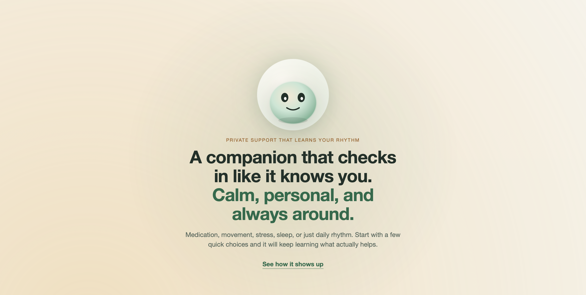

<div align="center">

<a href="https://vlbandara.github.io/healthclaw/">
  
</a>

# Healthclaw

**Private, local-first wellbeing companion with calm companion UX, browser-first setup, and optional Open Wearables integration.**

Healthclaw turns the lightweight `nanobot` agent core into a calmer, more opinionated product for private wellbeing support and self-hosted daily use.

[Product Page](https://vlbandara.github.io/healthclaw/) • [Getting Started](docs/GETTING_STARTED.md) • [Self-Hosting](docs/SELF_HOSTING.md) • [Open Wearables](docs/OPENWEARABLES.md)

[](https://www.python.org/)
[](LICENSE)
[](https://github.com/vlbandara/healthclaw/actions/workflows/ci.yml)
[](https://github.com/HKUDS/nanobot)

</div>

> **Fork notice**
>
> Healthclaw is a fork of [nanobot](https://github.com/HKUDS/nanobot), adapted for a privacy-first wellbeing companion experience.
> The public product name is **Healthclaw**.
> For v0.2 compatibility, some internal identifiers still use `nanobot`, including the Python package, CLI command, config paths, and `NANOBOT_*` environment variables.

## What It Is

Healthclaw runs a personal AI companion on infrastructure you control. It can start in browser chat, optionally talk through Telegram, keep long-term memory in your self-hosted workspace, and run scheduled check-ins.

The repo is intentionally positioned between a general-purpose agent framework and a narrow product wrapper: you still get a readable, hackable codebase, but the default experience is steered toward privacy-first wellbeing companionship rather than generic automation.

If you want the fast product overview first, use the public GitHub Pages site: [vlbandara.github.io/healthclaw](https://vlbandara.github.io/healthclaw/).

For a first-time visitor, the short version is:

- bring your own model provider: local Ollama or hosted APIs
- onboard through a web flow, then continue in browser chat
- optionally connect Telegram after the local setup works
- self-host the stack with Docker instead of relying on a SaaS backend

This repository is aimed at self-hosters and contributors who want:

- local-first deployment with Ollama + Gemma
- a clear path to cloud providers when local models are not practical
- a browser-first self-host beta that is easy to inspect and contribute to
- documented behavior, reproducible builds, and public CI

Healthclaw is for educational, personal, and research use. It is **not** a medical device and not a substitute for professional healthcare.

## Highlights

- **Private by default**: local model support via Ollama keeps prompts and memory on your machine
- **Fork with compatibility**: Healthclaw branding on public surfaces, `nanobot` runtime identifiers preserved for v0.2
- **Browser-first setup**: activate locally without needing a chat-app token
- **Optional Telegram**: connect BotFather when you want chat-app delivery
- **Operator-friendly**: Docker, migrations, health endpoints, tests, and CI included

## Positioning

Healthclaw is best understood as a focused fork with two lineages:

- **From nanobot**: the lightweight Python agent core, chat-channel architecture, memory model, and self-hosting path
- **Alongside OpenClaw**: a more product-shaped agent experience, stronger opinionation around user workflows, and compatibility-minded skill conventions

That makes Healthclaw a better fit when you want a companion that feels deliberate and private, not just a general-purpose agent shell. The biggest differences are the health-specific onboarding and prompt stack, browser-first self-host setup, calm companion tone, and optional Open Wearables grounding for more context-aware coaching.

## Comparison

| Dimension | [OpenClaw](https://github.com/openclaw/openclaw) | [nanobot](https://github.com/HKUDS/nanobot) | Healthclaw |
|---|---|---|---|
| Primary goal | Cross-platform personal AI assistant | Ultra-lightweight personal AI agent | Privacy-first wellbeing companion |
| Core shape | Broader assistant platform with gateway-centric workflows and optional device apps | Small, readable Python core with channels, memory, MCP, and deployment docs | Opinionated fork of nanobot for health and daily support scenarios |
| Best fit | Users who want a general assistant across more surfaces and devices | Builders who want a minimal agent they can study and extend | Individuals or families who want a calmer self-hosted companion with isolated memory |
| Interaction style | Gateway plus optional desktop and mobile companion surfaces | CLI, chat channels, API, dev WebUI | Web onboarding plus browser chat, with optional Telegram |
| Privacy posture | Personal assistant platform with local control options | Self-hostable with local or hosted model providers | Explicitly local-first, with separate per-user workspaces and memory boundaries |
| Multi-tenancy model | General personal-assistant workflows across devices and apps | General-purpose agent runtime | Single-user self-host beta first; family/workspace isolation is deferred to local experimental docs |
| Wearables support | Broad assistant platform; this repo does not position OpenClaw around Healthclaw-style wellness data grounding | No built-in Healthclaw wearables onboarding flow in the upstream product | Optional Open Wearables integration with provider linking, sync, encrypted snapshot storage, and coaching-aware summaries |
| Companion vibe | Personal assistant | Personal agent | Calm, grounded, coach-like companion shaped by health-specific onboarding, tone, lifecycle, and check-in prompts |
| Domain focus | General-purpose personal assistant | General-purpose personal agent | Wellbeing check-ins, companion conversations, and self-hosted daily support |
| Runtime identity | `openclaw` brand and runtime | `nanobot` brand and runtime | `Healthclaw` brand with `nanobot` runtime compatibility in v0.2 |

## Product Page

The repo includes a static GitHub Pages site in [`site/`](site/index.html) so visitors can understand Healthclaw without entering the live onboarding flow.

- Expected URL: [vlbandara.github.io/healthclaw](https://vlbandara.github.io/healthclaw/)
- Deploy source: `.github/workflows/pages.yml`
- Static assets: `site/assets/`
- Publish trigger: push to `main`

## Choose Your Setup Path

| Path | Best for | What you need |
|---|---|---|
| Local + private | Personal use, demos, privacy-first setups | Docker and Ollama |
| Hosted provider | Faster setup on lighter hardware | Docker and a provider API key |

## Quick Start

### 1. Clone and Configure

```bash
git clone https://github.com/vlbandara/healthclaw.git
cd healthclaw
cp .env.example .env
uv run healthclaw init-local --env-file .env.local
```

### 2. Pick a Provider

Local and private with Ollama:

```bash
curl -fsSL https://ollama.com/install.sh | sh
ollama pull gemma:7b
```

The generated `.env.local` includes a fresh health-vault key, strong database password, local Ollama defaults, and no shell-provided provider keys.

If you configure manually, set at least:

```env
NANOBOT_AGENTS__DEFAULTS__PROVIDER=ollama
NANOBOT_AGENTS__DEFAULTS__MODEL=gemma:7b
OLLAMA_API_BASE=http://host.docker.internal:11434
HEALTH_VAULT_KEY=generate-a-fernet-key
POSTGRES_PASSWORD=change-me
```

Hosted provider with OpenRouter:

```env
NANOBOT_AGENTS__DEFAULTS__PROVIDER=openrouter
NANOBOT_AGENTS__DEFAULTS__MODEL=openai/gpt-4o-mini
OPENROUTER_API_KEY=your-key
HEALTH_VAULT_KEY=generate-a-fernet-key
POSTGRES_PASSWORD=change-me
```

### 3. Start the Stack

Bring up the core services:

```bash
docker compose --env-file .env.local up -d --build postgres redis orchestrator worker
uv run healthclaw doctor --env-file .env.local
```

Open the onboarding surface at `http://localhost:18080`, finish setup, then use the browser chat link. Telegram is optional.

If you also want wearable integrations, configure Open Wearables first and use the wearables step during hosted setup. See [Open Wearables Integration](docs/OPENWEARABLES.md).

If you want the longer walkthrough, use [Getting Started](docs/GETTING_STARTED.md).

## Runtime Compatibility

The following names remain unchanged in this release:

- CLI: `nanobot`
- CLI alias: `healthclaw`
- Python package: `nanobot`
- env vars: `NANOBOT_*`
- default state directory: `~/.nanobot`

That compatibility layer is intentional for v0.2. Healthclaw is the public brand; `nanobot` is still the runtime identifier set.

## Documentation

- [Getting Started](docs/GETTING_STARTED.md)
- [Architecture](docs/ARCHITECTURE.md)
- [Customization](docs/CUSTOMIZATION.md)
- [Memory Model](docs/MEMORY.md)
- [Family Local Setup](docs/FAMILY_WELLBEING_LOCAL_SETUP.md)
- [Self-Hosting](docs/SELF_HOSTING.md)
- [Release Checklist](docs/RELEASE_CHECKLIST.md)
- [Open Wearables Integration](docs/OPENWEARABLES.md)
- [Local Development](docs/LOCAL_DEVELOPMENT.md)
- [FAQ](docs/FAQ.md)
- [Security Policy](SECURITY.md)

## Contributing

Healthclaw is an open-source fork of nanobot and contributions are welcome.

- [Contributing Guide](CONTRIBUTING.md)
- [Code of Conduct](CODE_OF_CONDUCT.md)
- [GitHub Discussions](https://github.com/vlbandara/healthclaw/discussions)
- [Issue Tracker](https://github.com/vlbandara/healthclaw/issues)

## Acknowledgements

Healthclaw builds on [nanobot](https://github.com/HKUDS/nanobot) by HKUDS. This fork keeps that foundation visible on purpose so contributors understand both the heritage and the compatibility choices in this repository.

## License

[MIT](LICENSE)
