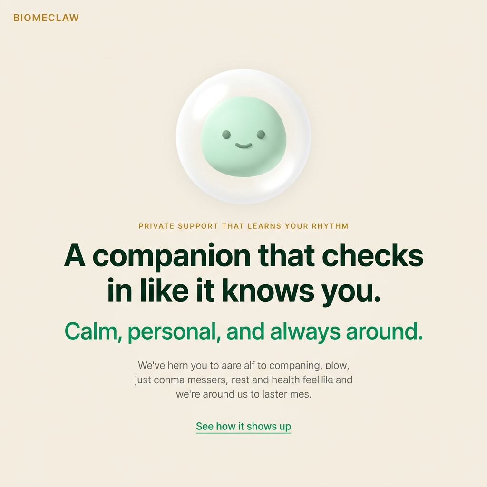

<div align="center">



# Healthclaw

**A companion that checks in like it knows you.** Calm, personal, and always around.

[](https://www.python.org/)
[](LICENSE)
[](https://ollama.com/)
[](https://github.com/HKUDS/nanobot)

</div>

---

## What is Healthclaw?

Healthclaw is a **private AI wellbeing companion** that runs on your own machine. It talks to you through Telegram (or other channels), remembers your habits and goals, checks in on your schedule, and learns what actually helps you over time.

It's not a clinical chatbot. It's the coach who texts you back at midnight, calls out your excuses without being mean, and actually remembers what you said three weeks ago.

**The key idea:** Run it locally with [Google's Gemma](https://ai.google.dev/gemma) via [Ollama](https://ollama.com/) — your conversations never leave your machine. Onboard your whole family, and each member gets their own **completely isolated** companion with zero data leakage between them.

---

## Why Healthclaw?

| | |
|---|---|
| 🔒 **Fully private** | Run 100% locally with Gemma via Ollama. No API subscriptions, no data sent anywhere |
| 👨‍👩‍👧‍👦 **Family mode** | Each family member gets their own isolated Docker workspace — separate memory, separate personality |
| 🧠 **Remembers you** | Layered memory system that consolidates and reflects, not just stores |
| 💬 **Feels human** | Warm, direct, sometimes dry — never corporate |
| 🌙 **2am mode** | Knows when to be quiet and grounding at night, when to push during the day |
| ⏰ **Proactive** | Daily heartbeat check-ins, medication reminders, habit tracking — on your schedule |
| 🔌 **Multi-channel** | Telegram, Discord, Slack, WhatsApp, Matrix, and more |

---

## Quick Start — Local & Private *(Recommended)*

Your data stays on your machine. No API keys needed.

### 1. Install Ollama and pull Gemma

```bash
# Install Ollama (macOS/Linux)
curl -fsSL https://ollama.com/install.sh | sh

# Pull Gemma 7B (recommended — ~8GB RAM)
ollama pull gemma:7b

# Or for lower-resource machines, use Gemma 2B
# ollama pull gemma:2b
```

### 2. Clone and configure

```bash
git clone https://github.com/vlbandara/healthclaw.git
cd healthclaw
cp .env.example .env
```

### 3. Add your Telegram bot token

```bash
# Get a bot token from @BotFather on Telegram, then edit .env:
TELEGRAM_BOT_TOKEN=123456789:YOUR_TOKEN_HERE
```

### 4. Start the stack

```bash
docker compose --env-file .env up -d --build postgres redis orchestrator worker
```

### 5. Say hello

Open Telegram, find your bot, and send a message. Healthclaw will greet you and begin the wellbeing onboarding.

> 📖 **[Full walkthrough →](docs/GETTING_STARTED.md)**

---

## Quick Start — Cloud API

Prefer a cloud LLM? Use OpenRouter, Anthropic, or OpenAI instead of local Gemma.

```bash
git clone https://github.com/vlbandara/healthclaw.git
cd healthclaw
cp .env.example .env
```

Edit `.env`:

```env
NANOBOT_AGENTS__DEFAULTS__PROVIDER=openrouter
NANOBOT_AGENTS__DEFAULTS__MODEL=anthropic/claude-opus-4-5
MINIMAX_API_KEY=sk-or-v1-your-key-here   # from openrouter.ai
```

Then start: `docker compose --env-file .env up -d --build postgres redis orchestrator worker`

---

## Family Onboarding

This is the killer feature. When `NANOBOT_MULTI_TENANT=true`:

```
Mom sends "Hi"  → Isolated workspace, separate memory, separate personality
Dad sends "Hi"  → Completely separate workspace, they never cross
You send "Hi"   → Your own private companion
```

Each person gets a personalized wellbeing coach processed against your private local Gemma instance.

> 📖 **[Family setup guide →](docs/FAMILY_WELLBEING_LOCAL_SETUP.md)**

---

## What Healthclaw Does

**Habit coaching** — Checks in daily, tracks patterns, defends your routines against drift. Relapse recovery, not guilt.

**Sleep support** — Monitors sleep quality, connects it to your goals. No lectures at midnight — just one anchor, one next move.

**Medication reminders** — Cron-powered reminders delivered on your schedule, through your preferred channel.

**Daily heartbeat** — Periodic background check-ins on a configurable interval.

**Memory that reflects** — Dream consolidation runs periodically to turn raw conversation into durable, curated knowledge about you.

---

## Architecture

```
┌──────────────────────────────────────────────────────┐
│                   Telegram / Channels                 │
└──────────────────────┬───────────────────────────────┘
                       │
        ┌──────────────▼──────────────┐
        │      Healthclaw Gateway      │
        │  ┌────────┐ ┌──────────┐   │
        │  │channels│ │ providers │   │
        │  └────────┘ └──────────┘   │
        │  ┌────────┐ ┌──────────┐   │
        │  │  agent │ │   cron   │   │
        │  └────────┘ └──────────┘   │
        │  ┌────────────────────┐   │
        │  │  SOUL · MEMORY ·   │   │
        │  │  HEARTBEAT         │   │
        │  └────────────────────┘   │
        └──────────────┬─────────────┘
                       │
        ┌──────────────▼──────────────┐
        │    Per-User Workspace       │
        │  (isolated Docker env)      │
        │  - SOUL.md & USER.md        │
        │  - memory/history.jsonl     │
        │  - health profile           │
        └─────────────────────────────┘
```

> 📖 **[Deep dive →](docs/ARCHITECTURE.md)**

---

## Memory System

Healthclaw's memory is layered and reflective — not just storage:

| Layer | What it does |
|-------|--------------|
| **Session** | Live conversation context |
| **History** | Append-only compressed archive (`memory/history.jsonl`) |
| **Dream** | Periodic consolidation that distills history into structured knowledge |
| **Long-term** | Curated files (`SOUL.md`, `USER.md`, `MEMORY.md`) — git-backed and restorable |

| Command | What it does |
|---------|--------------|
| `/dream` | Run memory consolidation now |
| `/dream-log` | Show latest memory change |
| `/dream-restore <sha>` | Restore memory to a previous state |

> 📖 **[Full documentation →](docs/MEMORY.md)**

---

## Chat Channels

| Channel | Setup |
|---------|-------|
| **Telegram** | Bot token from [@BotFather](https://t.me/BotFather) |
| **Discord** | Bot token + Message Content intent |
| **Slack** | Socket Mode (no public URL needed) |
| **WhatsApp** | QR scan (`nanobot channels login whatsapp`) |
| **Matrix** | Homeserver URL + access token |
| **Email** | IMAP/SMTP credentials |

> 📖 **[Channel plugin guide →](docs/CHANNEL_PLUGIN_GUIDE.md)**

---

## AI Providers

| Provider | Best for |
|----------|----------|
| `ollama` | **Local & private** — Gemma, Llama, Mistral |
| `openrouter` | Unified access to many models |
| `anthropic` | Claude direct |
| `openai` | GPT-4, GPT-4o |
| `deepseek` | DeepSeek models |
| `groq` | Free Whisper for voice messages |

---

## In-Chat Commands

| Command | What it does |
|---------|--------------|
| `/new` | Start a new conversation |
| `/stop` | Stop the current task |
| `/restart` | Restart the bot |
| `/status` | Show bot status |
| `/dream` | Run Dream consolidation |
| `/dream-log` | Show latest Dream change |
| `/dream-restore <sha>` | Restore memory to before a specific change |

---

## Configuration & Customization

- **Personality:** Edit `SOUL.md` to change your companion's voice and style
- **Tone presets:** Gentle, Direct, or Calm — [docs/CUSTOMIZATION.md](docs/CUSTOMIZATION.md)
- **Prompts:** See the full [prompt architecture](docs/NATURAL_COMPANION_PROMPTS.md)
- **Self-hosting:** Deploy on any VPS — [docs/SELF_HOSTING.md](docs/SELF_HOSTING.md)

---

## Documentation

| | |
|---|---|
| [Getting Started](docs/GETTING_STARTED.md) | Step-by-step beginner guide |
| [Family Setup](docs/FAMILY_WELLBEING_LOCAL_SETUP.md) | Multi-user local deployment |
| [Architecture](docs/ARCHITECTURE.md) | System design deep dive |
| [Memory System](docs/MEMORY.md) | How memory works |
| [Customization](docs/CUSTOMIZATION.md) | Personality, tone, and skills |
| [Self-Hosting](docs/SELF_HOSTING.md) | Deploy on your own server |
| [Security](SECURITY.md) | Security best practices |
| [Prompt Architecture](docs/NATURAL_COMPANION_PROMPTS.md) | How the companion voice works |
| [FAQ](docs/FAQ.md) | Common questions |

---

## Contributing

We welcome contributions of all sizes.

- 🐛 [Report a bug](https://github.com/vlbandara/healthclaw/issues/new?template=bug_report.md)
- 💡 [Request a feature](https://github.com/vlbandara/healthclaw/issues/new?template=feature_request.md)
- 💬 [Ask a question](https://github.com/vlbandara/healthclaw/discussions)

Please read our [Code of Conduct](CODE_OF_CONDUCT.md) before participating.

> 📖 **[Contributing guidelines →](CONTRIBUTING.md)**

---

## Roadmap

See [ROADMAP.md](ROADMAP.md) for what's planned and how to help shape the direction.

---

## Acknowledgements

Healthclaw is a wellbeing-focused fork of [nanobot](https://github.com/HKUDS/nanobot) by the HKUDS team. We're grateful for their excellent foundation.

---

## License

[MIT](LICENSE) — use it, modify it, share it.

*Healthclaw is for educational, research, and personal use. It is not a medical device and not a substitute for professional healthcare.*