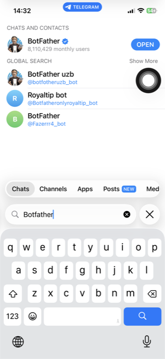
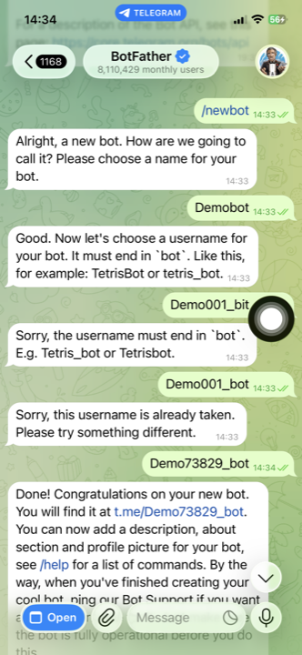
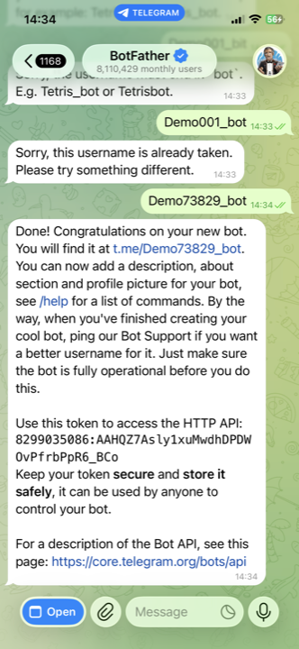

# Telegram BotFather Setup

This is the short version for getting a Telegram bot connected without wasting time on taken usernames.

## 1. Find BotFather

Open Telegram and search for `BotFather`. Enter the verified chat.

## 2. Create the bot

Send `/newbot`.

- Display name: anything human-readable.
- Username: must end in `bot`.
- Most short names are already taken, so use a random suffix right away.

Examples:

- `mybot48291_bot`
- `yourname_health731_bot`
- `calmcheck284_bot`

## 3. Copy the token

BotFather will send back a token. Paste that into setup to connect the bot.

- Keep the token private.
- If it leaks or gets lost, regenerate it in BotFather with `/token`.

## Timezone note

The browser setup detects your local timezone automatically. You can edit it before finishing setup, and you can change it later in chat if your schedule or location changes.
